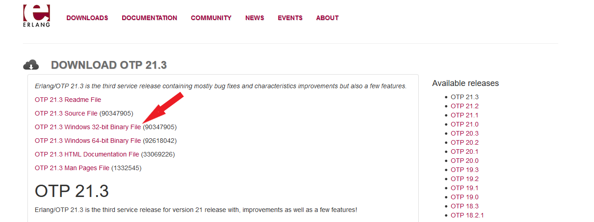
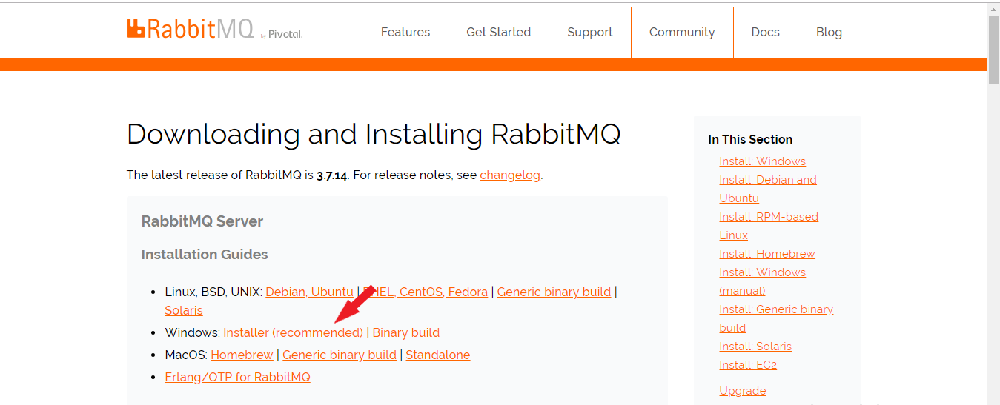
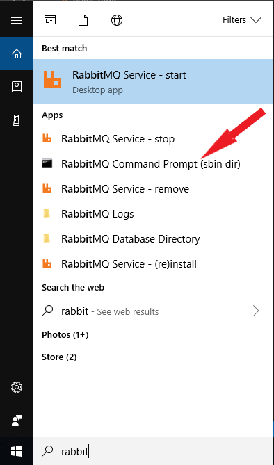
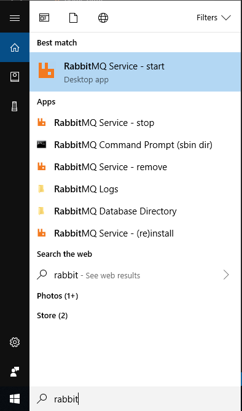
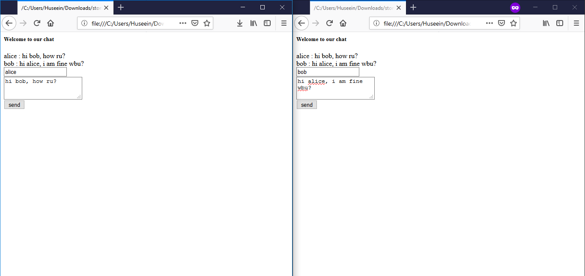

## Installation

rabbitmq requires Erlang installed first, you can install it from [here](https://www.erlang.org/downloads)

for rabbitmq installing link from [here](https://www.rabbitmq.com/download.html)

then you have to apply rabbitmq manager as follow.

press win then type rabbit

then paste the following command:

`$  rabbitmq-plugins enable rabbitmq_management`

then start rabbitmq

## test
for test open file home.html on the browser (note: don't use chrome it has problem with http not secuire requests, user Fiefox recommended.)

and open another incognito window.
## Output Examlpe

## License
[MIT](https://choosealicense.com/licenses/mit/)
